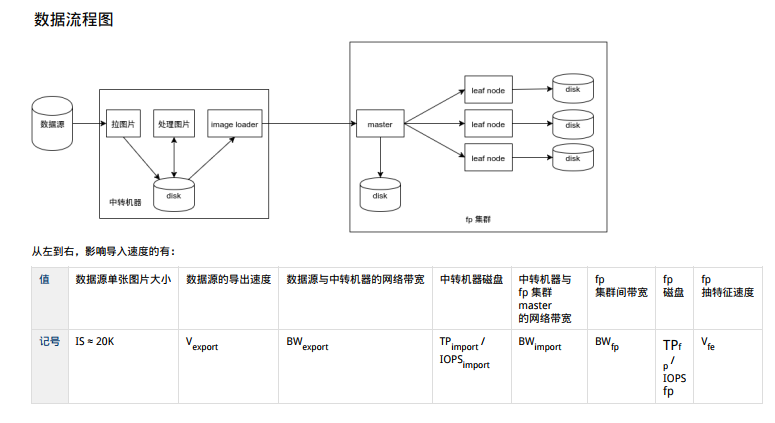
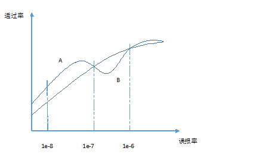

#BTS Pretest

###Part 1. Please submit your program to the following question: 
**Question 1:**

- Resource:
	- Working environment : ubuntu 16.04.
	- Assuming that there existed a folder containing over 10 million images. 
	- Assuming that each image was named in format PERSONALID_NAME(e.g 110102193502033321_张三)
	- Certain amount of images were monochrome that we do not want to use in feature extraction. 

- To be submitted:
	- A Readme file 
	- An excutable program that implement the following functionalities:
		- Eliminate all monochrome images
		- Modify naming format for all images to NAME_GENDER_PERSONALID (e.g 张三_男_110102193502033321).
	
###Part 2. Please submit a solution to the situation described below:

- According to the following feature-extraction architecture, please calculate the total time-cost to accomplish a 52 million image-feature-extraction task and submit your calculating process. 
- Resource:
	- Vfe = 160(photo/seconds)
	- Internal Server uses HDD & FP cluster (E5-2680*2) uses SDD  
	- All bandwith >= 20M/s

###Part3. 
- 动态视频人脸布控原理:
	将前端摄像头抓拍的人脸与固定数量的目标人脸照片一一比对，如果抓拍人脸与某一个或多个目标照片的相似度高于一定数值，系统就会产生报警。如果报警的两人是同一个人，这种报警叫做正确报警，反之为错误报警。
- 名词解释:
	- 通过率：正确报警的数量除以实际通过前端摄像头的目标人物数量。
	- 误报率：错误报警的数量除以总的比对次数。 
 	- 布控库：固定数量的目标人脸照片。
- 题目：
	已知在动态视频人脸布控测试中，A、B两家人脸算法的ROC曲线如下图所示：

- 假设在一次人脸动态测试中，你代表A厂家和B进行竞赛，要求赢得最终的胜利，以下能达成目标的是：（）
	评分标准为：每段视频在误报数量为1的情况下，通过率越高最终得分越高。
	A：符合标准测试的视频1段，人流量100人，标准布控库1万；
	B：符合标准测试的视频1段，人流量1000人，标准布控库1万；
	C：符合标准测试的视频2段，每段人流量100人，标准布控库5万；
	D：符合标准测试的视频2段，每段人流量1000人，标准布控库5万；
	E：符合标准测试的视频3段，每段人流量100人，标准布控库10万；
	F：符合标准测试的视频3段，每段人流量1000人，标准布控库10万；

